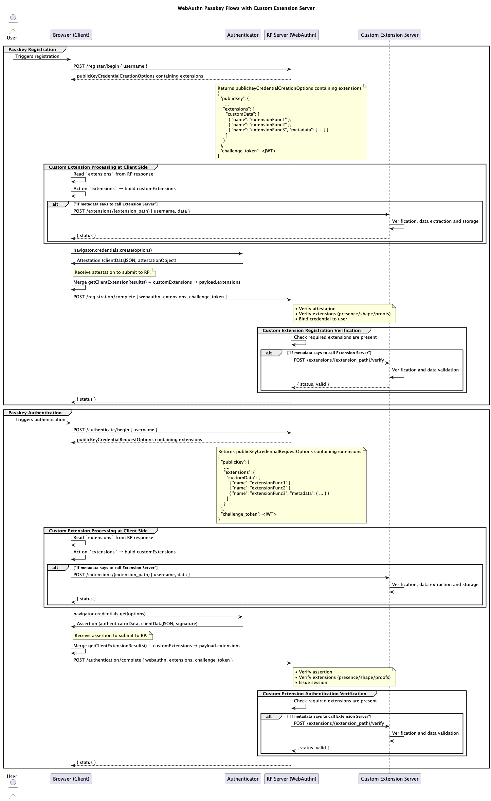

# 🛡️ FIDO2 + WebAuthn Passkeys with Custom Extensions (POC)


This proof-of-concept demonstrates a passkey-based authentication flow using **FIDO2/WebAuthn** with **custom extensions**.
The RP (Relying Party) can instruct the client to run **custom extension logic** during registration or authentication,
optionally calling the Extension Server based on provided metadata.

The client merges **WebAuthn’s `getClientExtensionResults()`** with any additional **custom extension data** into the
payload sent to the RP. The RP verifies WebAuthn responses and may delegate extension verification to the Extension Server.

---

## ✅ Key Features

* Standards-compliant WebAuthn flows for registration and authentication.
* **Server-driven custom extensions** with optional Extension Server calls based on metadata.
* Stateless challenge handling with signed `challenge_token`.
* Clear separation between authentication logic (RP) and business/analytics logic (Extension Server).
* Works with real or virtual authenticators in modern browsers.

---

## 🧩 Architectural Principles

* **Server-Driven**: RP includes `extensions.customData[]` in `/begin` responses, with optional `metadata` for each
  extension.
* **Conditional Extension Server Calls**: The client only calls the Extension Server if `metadata` indicates a server
  interaction is required.
* **Stateless**: No backend sessions — validation is bound to short-lived signed `challenge_token`.
* **Isolated Concerns**: RP verifies WebAuthn responses; Extension Server verifies extension proofs.
* **FIDO2/WebAuthn Compliance**: Uses `extensions` in the publicKey options and merges client+custom data before sending
  to RP.

---

## 🧱 Components

### 1. `passkey_web` (Web Client)

* Calls `/register/begin` or `/authenticate/begin` on RP.
* Reads `extensions.customData[]` from RP’s response.
* Optionally calls Extension Server(s) if `metadata` requires it.
* Invokes `navigator.credentials.create()` or `navigator.credentials.get()`.
* Merges `getClientExtensionResults()` with custom extension data into `extensions` field before sending to RP.

### 2. `passkey_server` (Relying Party)

* Generates WebAuthn `publicKeyCredentialCreationOptions` or `publicKeyCredentialRequestOptions`.
* Embeds `extensions.customData[]` in these options, along with `challenge_token`.
* Verifies attestation/assertion responses.
* Verifies extension data (either locally or via Extension Server `/verify`).

### 3. `extension_server` (Custom Extension Server)

* Handles client-submitted extension data before WebAuthn call.
* Issues optional signed proofs binding data to `challenge_token`.
* Responds to RP verification callbacks.

---

## 🧾 Flow Summary



### Registration

1. **Client → RP**: `POST /register/begin { username }`
2. **RP → Client**: WebAuthn creation options with `extensions.customData[]` + `challenge_token`.
3. **Client**: Reads extensions; calls Extension Server(s) if `metadata` says so.
4. **Client → Authenticator**: Calls `navigator.credentials.create(options)`.
5. **Client**: Merges `getClientExtensionResults()` + custom extension data → `extensions` field.
6. **Client → RP**: `POST /registration/complete { webauthn, extensions, challenge_token }`.
7. **RP**: Verifies WebAuthn and extensions (local or via `/verify`).
8. **RP → Client**: `{ status }`.

### Authentication

1. **Client → RP**: `POST /authenticate/begin { username }`
2. **RP → Client**: WebAuthn request options with `extensions.customData[]` + `challenge_token`.
3. **Client**: Reads extensions; calls Extension Server(s) if `metadata` says so.
4. **Client → Authenticator**: Calls `navigator.credentials.get(options)`.
5. **Client**: Merges `getClientExtensionResults()` + custom extension data → `extensions` field.
6. **Client → RP**: `POST /authentication/complete { webauthn, extensions, challenge_token }`.
7. **RP**: Verifies WebAuthn and extensions (local or via `/verify`).
8. **RP → Client**: `{ status }`.

---

## Example Payload

### 📜 Example `/begin` Response

```json
{
  "publicKey": {
    "...": "...",
    "extensions": {
      "customData": [
        {
          "name": "extensionFunc1"
        },
        {
          "name": "extensionFunc2"
        },
        {
          "name": "extensionFunc3",
          "metadata": {
            ...
          }
        }
      ]
    }
  },
  "challenge_token": "<JWT>"
}
```

### 📜 Example `/complete` Payload

```json
{
  "attestation": {
    "id": "...",
    "rawId": "...",
    "type": "public-key",
    "response": {
      "attestationObject": "...",
      "clientDataJSON": "...",
    },
    "extensions": {
      "customData": [
        {
          "name": "extensionFunc1", "value": {...}
        },
        {
          "name": "extensionFunc1", "value": {...}
        },
        { "name": "extensionFunc3", "value": {} }
      ]
    }
  },
  "challenge_token": "<JWT>"
}
```

---

## 📦 Project Structure

```bash
webauthn-custom-extension/
├── backend/                     # Backend services (RP server, extension server)
│   ├── pyproject.toml                 # Root-level lint/test config for Python (optional)
│   ├── uv.lock                        # uv lockfile for Python dependencies
│   ├── apps/
│   │   ├── extension_server/          # Custom extension server (FastAPI, pyproject.toml)
│   │   │   ├── .env.example
│   │   │   ├── config.py
│   │   │   ├── main.py
│   │   │   └── services/
│   │   ├── passkey_server/            # RP server (FastAPI, pyproject.toml)
│   │   │   ├── .env.example
│   │   │   ├── config.py
│   │   │   ├── main.py
│   │   │   └── services/
│   │   └── shared_utils/             # Utils
│   │       └── logging_config.py
│   └── tests/
│       ├── extension_server/
│       └── passkey_server/
│
├── frontend/                     # Frontend
│   └── passkey_web/               # Web frontend (Vite + Vanilla JS)
│       ├── public/
│       ├── src/
│       ├── .env.example
│       ├── .prettierrc.json
│       ├── eslint.config.js
│       ├── index.html
│       ├── package.json
│       ├── package-lock.json
│       ├── setupTests.js
│       ├── style.css
│       ├── vite.config.js
│       └── vitest.config.js
│
├── diagrams/                      # sequence.puml, architecture.puml, etc.
│
├── .github/                       # GitHub Actions workflows
│   └── workflows/
│       ├── backend.yml            # Backend CI workflow
│       └── frontend.yml           # Frontend CI workflow
│
├── taskfile.yml                   # Taskfile for managing tasks (install, dev, lint, etc.)
│
├── .gitignore                     # Git ignore rules
│
└── README.md                      # Project overview and setup instructions
```

---

## 🚀 Getting Started

**Requirements:** Python 3.12+, Node.js, [`uv`](https://github.com/astral-sh/uv)

1️⃣ Install dependencies:

```bash
# Install all dependencies
task install
```

2️⃣ Set up environment variables:

```bash
# Copy the env and modify as needed
task env:setup
```

3️⃣ Start all services:

```bash
# Start all services
task dev
```

* RP Server: [http://localhost:8000](http://localhost:8000)
* Extension Server: [http://localhost:9000](http://localhost:9000)
* Web Client: [http://localhost:5173](http://localhost:5173)

4️⃣ Test the flow:

Open the web client in your browser and follow the registration and authentication steps.

**Testing Tips:**
Test using Chrome DevTools → WebAuthn Panel https://developer.chrome.com/docs/devtools/webauthn

> Open Chrome DevTools, More Options (**⋮**) → More tools → WebAuthn to open the WebAuthn panel.
> In the panel, `Enable virtual authenticator environment` -> Add an authenticator (Protocol: `CTAP2`, Transport: `USB`)

---

## 📚 References

* [WebAuthn Spec (W3C)](https://www.w3.org/TR/webauthn-3/)
* [MDN: WebAuthn Extensions](https://developer.mozilla.org/en-US/docs/Web/API/Web_Authentication_API/WebAuthn_extensions)
* [FIDO2: Server Guidance](https://developers.google.com/identity/passkeys/developer-guides/server-introduction)
